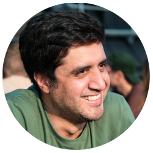

    

### Hi there 👋
Im Mohsen Mirzakhani, A fulltime Dad and a Software Engineer. I been working in the software industry for over 10 years. I have a passion for learning and sharing my knowledge with others as publicly as possible. I am a big fan of open-source software and I am always looking for ways to contribute to the community.

### 📫 How to reach me:
I am always open to new opportunities and collaborations. Feel free to reach out to me via LinkedIn or Github:

LinkedIn: [Mohsen Mirzakhani](https://www.linkedin.com/in/mirzakhany/)
Github: [mirzakhany](https://www.github.com/mirzakhany/)

### 🌱 I’m currently learning:
Im currently working as a Senior Software Engineer at [VOI](https://www.voi.com/). I am always looking for ways to improve my skills and learn new technologies. I am currently learning about Machine Learning and AI. and also building some cool projects in my free time.

### ⚡ Fun fact:
Im Electronic Engineer by education and Software Engineer by profession. and love to work on hardware projects in my free time. I have built a few cool projects like a smart mirror, a home automation system, and a few more.
I love to travel and explore new places. I am a big fan of hiking and camping. I also enjoy playing video games and watching movies in my free time.

